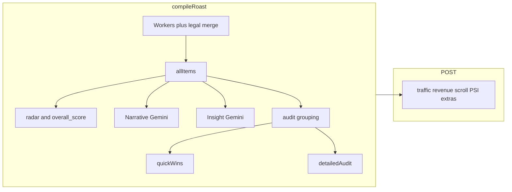

# Report structure notes (payload → surfaces)

Maps stored roast/report JSON fields to UI, HTML export, and PDF. Pipeline details: [`vibecheck_URL_to_Report_Workflow_and_LLM_Prompts.md`](../vibecheck_URL_to_Report_Workflow_and_LLM_Prompts.md), [`Vibecheck_Audit_Parameters_Inventory.md`](../Vibecheck_Audit_Parameters_Inventory.md).

## Assembly

| Stage | Location |
|-------|----------|
| Core payload inside `compileRoast` | [`src/app/api/roast/route.ts`](../src/app/api/roast/route.ts) (`quickWins`, `detailedAudit`, narrative, insight layers, `audit_items`, radar) |
| Enrichment after `compileRoast` | Same file `POST` handler: `trafficEstimate`, `revenueLeakEstimate`, `scrollEffectiveness`, PSI/on-page/meta/tech/behaviour fields, `performanceGemini` |

## Section mapping

### Summary / assessment / next steps

| JSON | Meaning | Where it renders |
|------|---------|------------------|
| `hook`, `overview.executiveSummary` | Exec summary line | [`src/app/roast/[id]/page.tsx`](../src/app/roast/[id]/page.tsx) hero “brief”; [`src/lib/pdf-templates.ts`](../src/lib/pdf-templates.ts); [`src/lib/report-html.ts`](../src/lib/report-html.ts) |
| `script`, `overview.roastAnalysis`, `analysis` | Long diagnostic | Roast page narrative; PDF/HTML equivalents |
| `verdict` | Short verdict | Hero + headings in exports where used |
| `closer`, `NEXT_STEPS` tone | Upsell / CTA prose | Roast page + PDF/HTML narrative blocks |

Worker audit rows (`audit_items`, `detailedAudit`) are separate from this narrative Gemini output.

### Signals tables (current → proposed + impact)

| JSON | Meaning | Where |
|------|---------|--------|
| `firstImpressionScore`, `trustGapIndex`, `messagingClarityScore` | `InsightLayerBlock` from insight Gemini + merge helpers | [`src/components/roast/insight-layer-card.tsx`](../src/components/roast/insight-layer-card.tsx) (“Current”, “→ proposed”, impact column via `ScoreTriple`) |

These are **not** built from individual worker `audit_items` rows.

### Quick wins

| JSON | Meaning | Where |
|------|---------|--------|
| `quickWins` / `quick_wins` | Top fixes (built in `compileRoast`; theme-deduped) | [`ReportQuickFixesBlock`](../src/components/roast/report-quick-fixes-block.tsx); [`ensureQuickWinsUpToFour`](../src/lib/quick-wins-fill.ts) pads older payloads; [`report-html.ts`](../src/lib/report-html.ts); [`pdf-templates.ts`](../src/lib/pdf-templates.ts) |

### Scroll profile

| JSON | Meaning | Where |
|------|---------|--------|
| `scrollEffectiveness` | Scroll narrative + effectiveness | Built in `POST`; consumed on roast page and related helpers (e.g. [`scroll-effectiveness-from-audit`](../src/lib/scroll-effectiveness-from-audit.ts)) |

Not derived from the quick-wins builder.

### SEO / technical appendix

| JSON keys | Meaning | Where |
|-----------|---------|--------|
| `seo`, `page_type`, `performance`, `performanceGemini` | Classic SEO snippet + PSI summary | [`RoastSeoHealthBlock`](../src/components/roast/roast-seo-health-block.tsx), [`RoastPageSpeedBlock`](../src/components/roast/roast-pagespeed-block.tsx); HTML via [`report-seo-appendix.ts`](../src/lib/report-seo-appendix.ts) |
| `performance_audit`, `on_page_seo`, `meta_preview`, `tech_stack`, `behaviour_tools` | Programmatic extended audit | [`RoastExpandedDiagnosticsSection`](../src/components/roast/roast-expanded-diagnostics-section.tsx); [`buildExtendedAuditAppendixHtml`](../src/lib/report-extended-audit-appendix.ts) inside SEO appendix |

## Deep dive (`detailedAudit`)

Category buckets (`ux`, `conversion`, …) feed paid HTML deep dive [`deepDiveFromDetailed`](../src/lib/report-html.ts), PDF category sections in [`pdf-templates.ts`](../src/lib/pdf-templates.ts), and roast UI category views. Rows are worker-shaped items after **theme grouping** (same schema as workers; deduped by `elementName` + `radarCategory`).

## Diagram

